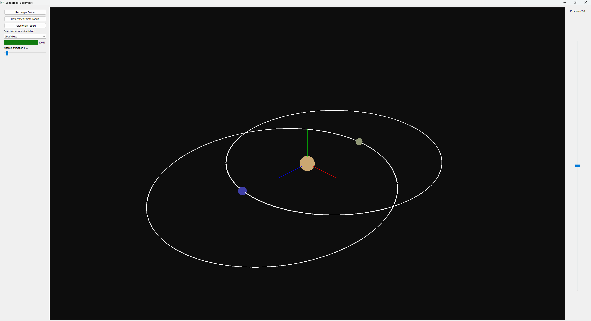

# 🌌 SpaceTool - Gravitational Simulation in 3D

**Author**: Julien Clero  
**License**: Non-Commercial 
**Last Updated**: August 2025

---

## 🚀 Overview

**SpaceTool** is an interactive 3D gravitational simulation built in Python using PyQt5 and OpenGL. It visualizes n-body orbital dynamics with real-time rendering and animation controls.

Bodies follow Newtonian gravity with RK4 integration and are rendered with VBO-based meshes. The system includes tools to toggle trajectories, change animation speed, and explore space with intuitive camera controls.

---

## 🖼 Features

- 🧠 **N-body gravitational dynamics** with RK4 integrator  
- 🧬 **Real-time 3D rendering** with OpenGL (via PyOpenGL)  
- 🔁 **Trajectory animation** with adjustable speed  
- 🔎 **Orbit & pan camera controls**  
- 📊 **Progress bar + threaded simulation**  
- 🔧 Extensible simulation builder (add bodies easily!)

---

## 🖥 GUI Preview

| Scene |
|-------|
|  |

---

## 🧩 Dependencies

- Python 3.8+
- numpy
- PyQt5
- PyOpenGL
- tqdm

Install dependencies with:

pip install -r requirements.txt

---

## 🎮 Controls

| Action        | Control                             |
| ------------- | ----------------------------------- |
| Rotate        | Left Mouse Drag                     |
| Pan           | Right Mouse Drag                    |
| Zoom          | Mouse Wheel                         |
| Toggle Points | `Trajectories Points Toggle` button |
| Toggle Lines  | `Trajectories Toggle` button        |
| Select Sim    | Dropdown Menu                       |
| Replay        | `Recharger Scène` button            |
| Adjust Speed  | Horizontal Slider                   |
| Jump in Path  | Vertical Slider                     |
